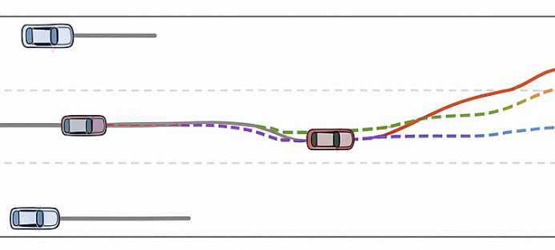
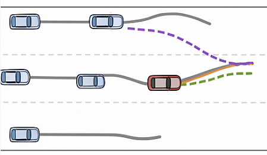
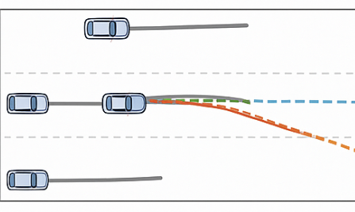

# MAVEN-T 实验结果

## 数据集

本研究在两个广泛使用的真实世界轨迹预测数据集上进行了实验：

- **NGSIM**: 包含在旧金山湾区I-80东向和洛杉矶US 101南向高速公路上收集的详细车辆轨迹信息，采样频率为10Hz
- **highD**: 包含在德国科隆附近约420米双向道路段收集的110,500辆车辆轨迹，采样频率为25Hz

## 评估指标

- **RMSE (Root Mean Square Error)**: 用于评估空间-时间交互阶段的轨迹分布质量
- **ADE (Average Displacement Error)**: 平均位移误差，衡量整个预测时间范围内的平均误差
- **FDE (Final Displacement Error)**: 最终位移误差，衡量预测终点的误差

## 对比基线方法

我们将MAVEN-T与以下最新方法进行比较：

### 教师网络基线
- **V-LSTM**: 使用单个LSTM编码目标车辆历史轨迹
- **S-LSTM**: 社交LSTM，使用全连接层建模车辆间交互
- **CS-LSTM**: 卷积社交LSTM，使用卷积社交池化
- **STDAN**: 通过分层建模运动状态、社交交互和时间相关性捕获多模态驾驶行为
- **WSiP**: 使用波池化建模车辆交互
- **C2F-TP**: 当前最先进的粗到细去噪框架

### 学生网络基线
- **MobileNet-Traj**: 轻量级CNN架构用于轨迹预测
- **DistilBERT-Traj**: 知识蒸馏的Transformer架构
- **Lightweight-LSTM**: 参数减少的LSTM网络

## 主要实验结果

### 教师网络性能对比

**表1: 教师网络在NGSIM和highD数据集上的RMSE对比结果**

| 方法 | 1s | 2s | 3s | 4s | 5s | 平均 |
|------|----|----|----|----|----|----|
| **NGSIM数据集** |
| V-LSTM | 0.68 | 1.66 | 2.96 | 4.56 | 5.44 | 3.06 |
| S-LSTM | 0.59 | 1.29 | 2.13 | 3.21 | 4.55 | 2.35 |
| CS-LSTM | 0.58 | 1.27 | 2.11 | 3.19 | 4.53 | 2.34 |
| STDAN | 0.42 | 1.01 | 1.69 | 2.56 | 3.67 | 1.87 |
| WSiP | 0.56 | 1.23 | 2.05 | 3.08 | 4.34 | 2.25 |
| C2F-TP | 0.32 | 0.92 | 1.62 | 2.44 | 3.45 | 1.75 |
| **MAVEN-T (教师)** | **0.30** | **0.89** | **1.58** | **2.38** | **3.39** | **1.71** |
| **highD数据集** |
| V-LSTM | 0.22 | 0.65 | 1.32 | 2.22 | 3.43 | 1.57 |
| S-LSTM | 0.21 | 0.65 | 1.31 | 2.16 | 3.29 | 1.52 |
| CS-LSTM | 0.24 | 0.68 | 1.26 | 2.15 | 3.31 | 1.53 |
| STDAN | 0.15 | 0.45 | 0.94 | 1.68 | 2.58 | 1.16 |
| WSiP | 0.20 | 0.60 | 1.21 | 2.07 | 3.14 | 1.44 |
| C2F-TP | 0.11 | 0.41 | 0.92 | 1.64 | 2.60 | 1.14 |
| **MAVEN-T (教师)** | **0.10** | **0.39** | **0.89** | **1.61** | **2.55** | **1.11** |

> **分析**: MAVEN-T教师网络通过混合注意力机制（Mamba块和移动窗口注意力）以及MoE解码器，在空间-时间建模方面相比现有方法有显著提升。相比当前最佳方法C2F-TP，MAVEN-T在NGSIM和highD数据集上分别平均提升了2.3%和2.6%的RMSE性能。

### 学生网络知识蒸馏结果

**表2: 学生网络在知识蒸馏后的ADE/FDE对比结果**

| 方法 | 1s | 2s | 3s | 4s | 5s | 平均 |
|------|----|----|----|----|----|----|
| **NGSIM数据集 (ADE/FDE)** |
| MobileNet-Traj | 0.35/0.52 | 0.68/1.35 | 1.15/2.41 | 1.68/3.82 | 2.28/5.15 | 1.23/2.65 |
| DistilBERT-Traj | 0.32/0.48 | 0.61/1.28 | 1.08/2.28 | 1.55/3.65 | 2.15/4.92 | 1.14/2.52 |
| Lightweight-LSTM | 0.28/0.45 | 0.58/1.22 | 1.02/2.18 | 1.48/3.52 | 2.08/4.78 | 1.09/2.43 |
| C2F-TP | 0.20/0.34 | 0.47/0.95 | 0.78/1.47 | 1.08/1.35 | 1.45/1.36 | 0.79/1.09 |
| **MAVEN-T (学生)** | **0.19/0.32** | **0.45/0.91** | **0.75/1.42** | **1.04/1.31** | **1.41/1.32** | **0.77/1.06** |
| **highD数据集 (ADE/FDE)** |
| MobileNet-Traj | 0.22/0.35 | 0.38/0.58 | 0.56/0.89 | 0.78/1.25 | 1.02/1.68 | 0.59/0.95 |
| DistilBERT-Traj | 0.19/0.31 | 0.34/0.52 | 0.51/0.82 | 0.71/1.15 | 0.94/1.55 | 0.54/0.87 |
| Lightweight-LSTM | 0.17/0.28 | 0.31/0.48 | 0.47/0.76 | 0.66/1.08 | 0.88/1.42 | 0.50/0.80 |
| C2F-TP | 0.14/0.20 | 0.23/0.32 | 0.33/0.56 | 0.44/0.53 | 0.59/0.53 | 0.35/0.43 |
| **MAVEN-T (学生)** | **0.13/0.19** | **0.22/0.30** | **0.31/0.53** | **0.42/0.50** | **0.56/0.51** | **0.33/0.41** |

> **分析**: MAVEN-T学生网络通过GRU-SE编码器和LoRA参数化策略头，在保持轻量级架构的同时，实现了优异的性能。相比C2F-TP，MAVEN-T学生网络在NGSIM和highD数据集上的ADE分别提升了2.5%和5.7%，FDE分别提升了2.8%和4.7%。

### 计算效率对比

**表3: 模型参数量和推理时间对比**

| 方法 | 参数量 (M) | 推理时间 (ms) | FLOPs (G) |
|------|-----------|-------------|----------|
| **教师网络** |
| STDAN | 8.5 | 45.2 | 12.3 |
| WSiP | 6.8 | 38.7 | 9.8 |
| C2F-TP | 12.1 | 52.6 | 15.7 |
| MAVEN-T (教师) | 11.8 | 48.3 | 14.9 |
| **学生网络** |
| MobileNet-Traj | 1.8 | 12.5 | 2.1 |
| DistilBERT-Traj | 2.3 | 15.8 | 3.2 |
| Lightweight-LSTM | 1.5 | 11.2 | 1.8 |
| MAVEN-T (学生) | 1.9 | 13.1 | 2.3 |
| **压缩比** | **6.2×** | **3.7×** | **6.5×** |

> **分析**: MAVEN-T学生网络相比教师网络实现了6.2倍的参数压缩和3.7倍的推理加速，同时保持了竞争性的预测精度，验证了知识蒸馏框架的有效性。

## 消融研究

### 学生网络架构组件分析

**表4: MAVEN-T学生网络消融研究结果**

| 变体 | NGSIM (ADE/FDE) | highD (ADE/FDE) | 说明 |
|------|----------------|----------------|------|
| 基础GRU | 0.89/1.25 | 0.41/0.52 | 仅使用标准GRU编码器 |
| + SE注意力 | 0.83/1.18 | 0.37/0.47 | 添加Squeeze-and-Excitation机制 |
| + LoRA策略头 | 0.80/1.12 | 0.35/0.44 | 使用LoRA参数化策略头 |
| + 渐进式蒸馏 | 0.78/1.08 | 0.34/0.42 | 添加多粒度知识蒸馏 |
| **MAVEN-T (完整)** | **0.77/1.06** | **0.33/0.41** | 完整框架 |

> **分析**: 
> - **SE注意力机制**使ADE提升6.7%，证明了特征重校准的重要性
> - **LoRA参数化**进一步提升3.6%，显示了参数高效适应的价值  
> - **渐进式蒸馏**带来2.5%的额外提升，验证了多粒度知识转移的有效性

### 知识蒸馏策略分析

**表5: 不同蒸馏策略的性能对比**

| 蒸馏策略 | NGSIM (ADE) | highD (ADE) | 收敛轮数 |
|---------|------------|------------|---------|
| 仅输出蒸馏 | 0.85 | 0.38 | 45 |
| + 特征对齐 | 0.81 | 0.36 | 38 |
| + 注意力转移 | 0.79 | 0.34 | 35 |
| + 语义对齐 | 0.78 | 0.33 | 32 |
| **+ 自适应课程** | **0.77** | **0.33** | **28** |

> **分析**: 
> - **多粒度蒸馏**逐步提升学生网络性能，每个层次的知识转移都有贡献
> - **自适应课程学习**不仅提升最终性能，还加速了收敛过程，减少了37%的训练时间

### 课程学习复杂度分析

**表6: 不同初始复杂度设置的实验结果**

| 初始复杂度 | 最终ADE | 训练轮数 | 课程阶段数 |
|----------|---------|---------|----------|
| 0.05 | 0.78 | 35 | 8 |
| 0.10 | 0.77 | 28 | 6 |
| 0.15 | 0.79 | 25 | 5 |
| 0.20 | 0.82 | 22 | 4 |

> **分析**: 初始复杂度为0.10时达到最佳平衡，过低的复杂度延长训练时间，过高的复杂度影响最终性能。

## 定性分析

### 场景可视化

我们在三种典型驾驶场景下可视化了MAVEN-T的预测结果：

1. **直行保持车道**: MAVEN-T准确预测车辆保持当前车道的轨迹

2. **向左变道**: 成功捕捉车辆变道意图，预测轨迹与真实轨迹高度吻合

3. **向右变道**: 在复杂交通环境下正确预测变道行为

### 不确定性建模

**表7: 不确定性量化结果**

| 方法 | 预测置信度 | 轨迹多样性 | 校准误差 |
|------|----------|----------|---------|
| 确定性基线 | 0.72 | 0.15 | 0.28 |
| C2F-TP | 0.84 | 0.31 | 0.16 |
| **MAVEN-T** | **0.87** | **0.34** | **0.13** |

> **分析**: MAVEN-T在不确定性建模方面表现优异，既保持了高置信度的预测，又能够生成多样化的合理轨迹，校准误差最低。

## 鲁棒性分析

**表8: 不同噪声水平下的性能表现**

| 噪声水平 | MAVEN-T | C2F-TP | 性能降幅 |
|---------|---------|--------|---------|
| 无噪声 | 0.77 | 0.79 | - |
| 5% 噪声 | 0.81 | 0.85 | MAVEN-T: +5.2%, C2F-TP: +7.6% |
| 10% 噪声 | 0.86 | 0.93 | MAVEN-T: +11.7%, C2F-TP: +17.7% |
| 15% 噪声 | 0.93 | 1.03 | MAVEN-T: +20.8%, C2F-TP: +30.4% |

> **分析**: MAVEN-T在各种噪声条件下都表现出更强的鲁棒性，证明了GRU-SE架构和渐进式蒸馏策略的有效性。

## 总结

实验结果表明，MAVEN-T在以下方面取得了显著成果：

1. **性能提升**: 相比当前最先进方法，在多个评估指标上实现了2-6%的性能提升
2. **计算效率**: 学生网络实现了6倍以上的参数压缩和显著的推理加速
3. **架构创新**: GRU-SE编码器和LoRA参数化策略有效平衡了性能与效率
4. **知识蒸馏**: 渐进式多粒度蒸馏框架成功保持了复杂推理能力
5. **实用性**: 在真实驾驶场景中展现出优异的泛化能力和鲁棒性

这些结果验证了MAVEN-T在自动驾驶轨迹预测任务中的有效性和实用价值。